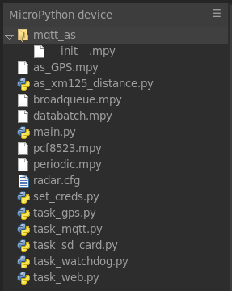

# Bogan Radar MicroPython Setup

The MicroPython program used in the current (2026 January) version of Bogan 
Radar has the following features:

* Data taken from XM125 radar at intervals of 5 seconds, with moderate timing
  accuracy. A system timer is used to minimize clock drift; each reading may be
  some milliseconds late, but subsequent readings are then made sooner to keep
  the overall timing accuracy as good as possible using cotasks.

* Data is saved to an SD card. Every few minutes, the file is opened, a batch
  of data is written, and the file is closed immediately thereafter. Having the
  file open for only a short time reduces the likelihood of data corruption on
  the card due to power losses or program crashes. 

* The ESP32's Real Time Clock (RTC) is assisted by a PCF8523 RTC on the SD card
  (data logger) circuit board. With a backup battery, the PCF8523 keeps time
  with the main power off; the ESP32 RTC loses track of time when power is lost.
  A GPS receiver module is used to set both RTC clocks, as the RTC clocks are
  not highly accurate and may lose a few seconds each day. 

* Data may be transmitted to an MQTT broker for capture and storage on a 
  computer at a remote site. A Raspberry Pi in the developer's closet is used
  for testing, but any old computer which can run an MQTT client can do the job;
  a low-power device is recommended to avoid wasting lots of energy keeping a
  PC running 24/7. 

* A tiny web server allows anyone with network access to the ESP32 through LAN 
  or its access point to download data files from the SD card, _if_ the system
  has been set up with WiFi access or it is set up as an access point.  Since
  the WiFi module in the ESP32 takes a lot of power, this capability is likely
  to be used only where an AC mains connection is available to the radar unit.

* To keep the system going in case of unexpected crashes, a watchdog timer is
  used.  The hardware watchdog timer in the ESP32 is used as well as a set of
  asyncio events that require the radar, SD card, and MQTT tasks to be working
  to prevent system resets. 

## Saving RAM

The ESP32 WROOM module used has limited RAM, and MicroPython is fairly resource
heavy. The program as currently used will run out of RAM and crash if all the
files are regular Python source files. 

Therefore, we upload many of the utility programs as byte-compiled `*.mpy` 
files; this reduces RAM usage somewhat and enables the program to run reliably.
The program `mpy-cross`, which is part of the MicroPython source code
distribution, is used to byte-compile MicroPython source code into `.mpy` 
files. See:  
<https://pypi.org/project/mpy-cross/>

<https://github.com/micropython/micropython/tree/master/mpy-cross>

For a technical discussion of `.mpy` files (probably not needed), see:  
<https://docs.micropython.org/en/latest/reference/mpyfiles.html>

The main file and task files are usually kept as regular Python source files
because we're editing them often to change program behavior, fix bugs, _etc._

## What Files?

An image of the file listing from a working Bogan Radar ESP32 file system is
shown below.



It's a little weird that the asyncio MQTT server is in a file `__init__.py` in
the `mqtt_as` folder on the ESP32 filesystem. It's that way for reasons of
convenience due to how the `mqtt_as` system is distributed; it's easier to just
follow the distribution (with a small subset of its files to save space) than 
reorganize the package. 


## Configuration

We find the Thonny IDE at <http://thonny.org> convenient for editing files on 
the ESP32. 

* To change radar operating parameters such as site name, minimum and maximum 
distance to the water, and time between data points, edit `radar.cfg` on the
ESP32 filesystem. 

* To change the MQTT server and MQTT topic, edit `task_mqtt.py` where all the
  necessary information is in constants near the beginning of the file. 
  We've been using `test.mosquitto.org` for testing. 

* To set the LAN SSID and password:

  * Run the script `set_creds.py` on the ESP32. This script will define a
    function `setlan()` which allows the SSID and password to be stored in the
    ESP32's nonvolatile memory -- but it will _not_ run the function. 
    
  * You should then call the function, giving it the SSID and password of the
    access point you plan to use, for example:  
    `setlan("my_lan_name", "lamepassword")

If you're not using MQTT or the file server, turn off the tasks and make sure
the watchdog task won't be expecting the MQTT task to keep reporting to it:

In `main.py`:
```.py
    batch = databatch.DataBatch(POINTS_PER_DATA_BATCH,
                                maxsize=MAX_DATA_QUEUE_SIZE, drop_old=True)
    consumer_A = batch.register()
   # consumer_B = batch.register()

    tasks = []
    tasks.append(asyncio.create_task(task_sd_card.task_SD_Card(consumer_A)))
   # tasks.append(asyncio.create_task(task_mqtt.mqtt_task(consumer_B)))
    tasks.append(asyncio.create_task(task_gps.gps_task(i2c, batch)))
    tasks.append(asyncio.create_task(task_radar(batch)))
    tasks.append(asyncio.create_task(task_watchdog.task_watchdog()))
   # asyncio.create_task(task_web.file_server_task())
```

In `task_watchdog.py`:
```.py
    await asyncio.gather( # mqtt_event.wait(),
                        sd_card_event.wait(),
                        radar_event.wait())
```

At this time, the file server task relies on the MQTT task to keep up a network
connection, so those two tasks must be activated or deactivated together. 
A future project should be to make an independent task which keeps the network
going for only the file server task. In addition, the web server could be 
kept off to save energy unless it is activated by some mechanism such as a
physical switch. 


