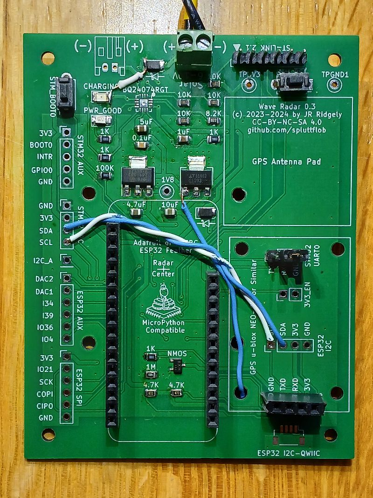
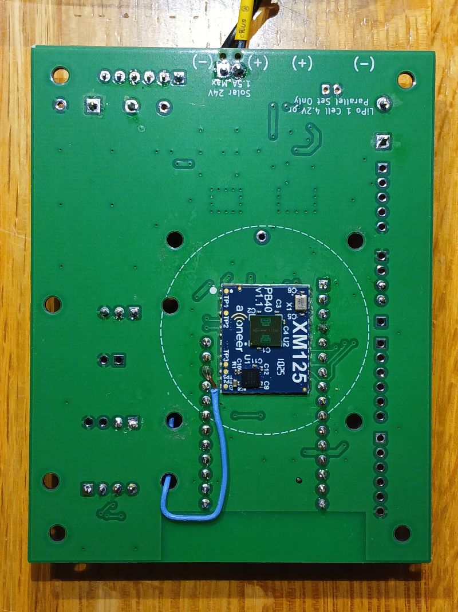

# Bogan Radar Board V1.3 Hacks

## I&sup2;C Connections

The method of communication between the ESP32 system control and networking 
microcontroller and the STM32 microcontroller on the XM125 radar board has been
changed from RS-232 to I&sup2;C.  Therefore, jumper wires must be connected 
between the ESP32's I&sup2;C terminals and those of the STM32. The twisted blue 
and white wires boing mostly left to right in the photo below connect the 
I&sup2;C signals. 

If the main board has been assembled correctly, the two 4.7K I&sup2;C pullup
resistors are already present. 

## AC _vs._ Solar and Battery Power

When deployed near a usable source of AC power, the radar system may be supplied
from a 5V DC adapter connected through the solar panel input. This connection is
made using the screw terminal at the top of the image above. _**Note:** 
Significantly higher voltages such as 12V should **not** be used, as the
regulators on the ESP32 Feather board are designed for 5V USB input and not
safe with higher voltages._ 

When using AC power, we can leave the BQ24074RGT charge controller off the 
board, bypassing it with a short wire such as the short white wire seen from
the right side of the CHARGING LED to the left side of the Schottky diode near
the screw terminals.  This supplies power to the 1.8V and 3.3V regulators on
the main board. 

In addition, power must be supplied directly from the input to the regulators
to the ESP32 Feather's USB power input.  The blue wire attached to the input
pin of the 3.3V regulator and extending downwards through an unused mounting
hole on the board does this.  This wire is connected to the ESP32 USB pin on 
the bottom of the board as seen in the photo below. 

_**Note:** The jumper wire should not pass through the holes which are closer
to the XM125 because doing so will interfere with the mounting fixture and 
screws that are used to attach the board to the antenna. The board must be
mounted correctly to the antenna for a strong signal to be received.  Also
note that the wire is on the right side of the Feather mounting pins because
the board mounting fixture must be up against the board on the left side._

