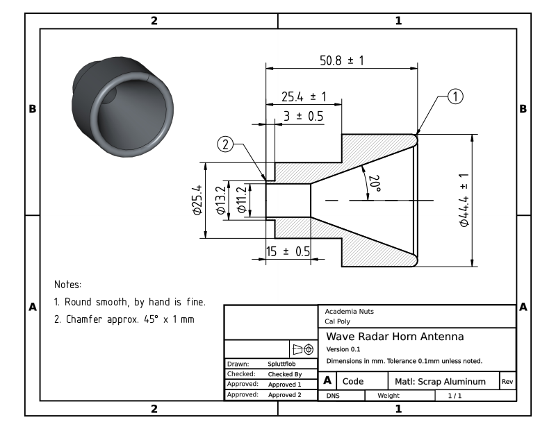
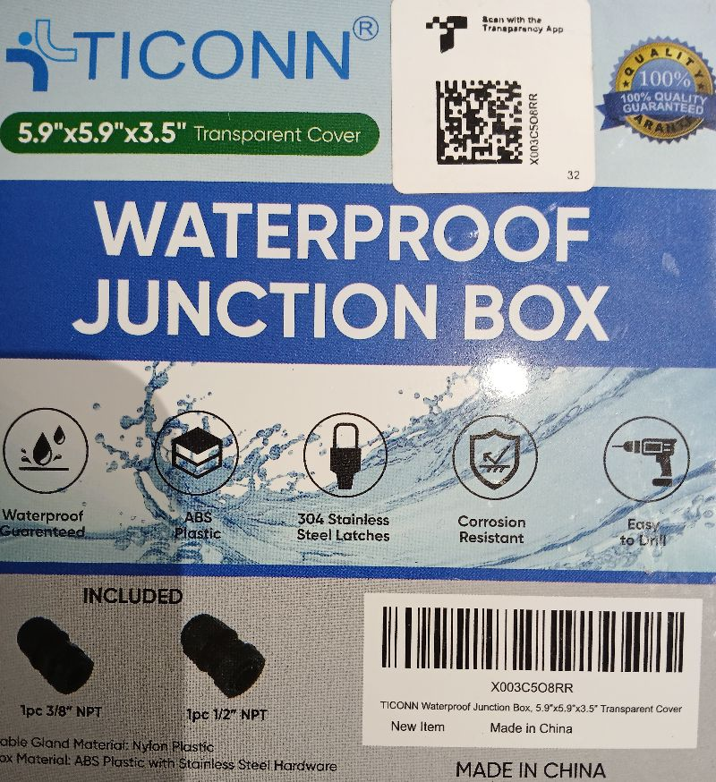
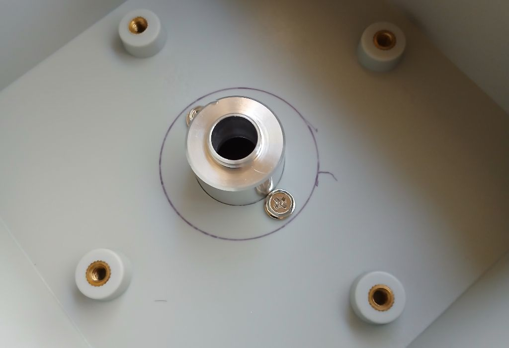
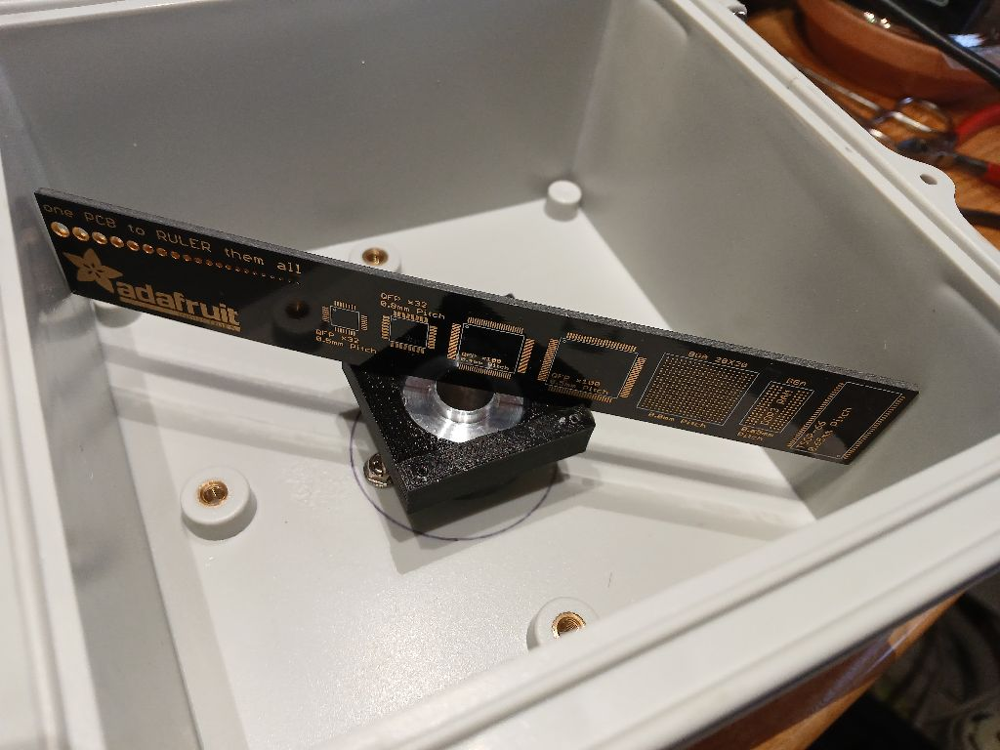
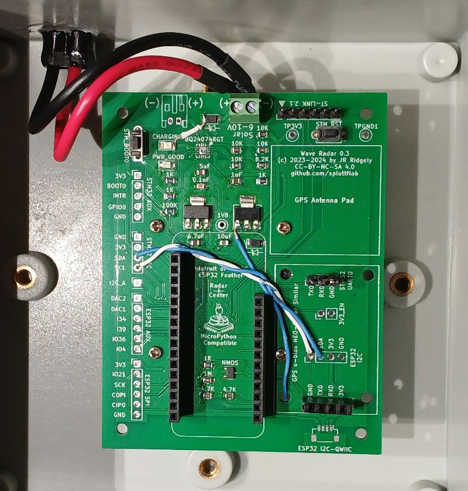
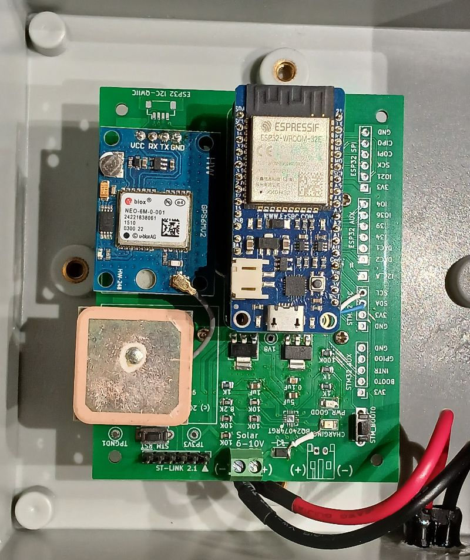

# Bogan Radar Hardware Notes

Version 1.3 (Still in alpha)

The current design uses the following bits:

* An Acconeer&trade; XM125 radar mounted to the bottom of a circuit board, with
  headers for many of the XM125 pins broken out to through holes on the board

* An Adalogger&trade; Featherwing for its SD card and battery backed up 
  real-time clock, mounted in a socket atop the board using stacking headers

* An ESP32 Feather board (EZSBC made boards preferred) mounted atop the 
  Adalogger
  
* A generic GPS receiver atop the circuit board

* A LiPo battery charging circuit built onto the board

The radar system is enclosed in a generic waterproof junction box. 
The board is mounted atop a horn-type millimeter-wave antenna that is attached
to the box with a waterproof seal.  The system is watertight so that it has a
chance to survive when deployed just above the ocean. 

## Board V1.3 Hacks

The design of the system has changed since a batch of the Version 1.3 boards
was manufactured, so there have been some hacks made involving jumper wires.
Please see [HACKS_1.3](HACKS_1.3.md) for details.

## RADAR Antenna

The horn antenna is a simple cylindrical design, manufactured mostly using a
lathe:

There are other antennas available such as plastic lenses. These may work well
also, and antenna testing and comparison are ongoing.

## Mounting in Enclosure

The branding of a typical enclosure is shown below.  This is not an endorsement
of this particular enclosure above others; it's just something we've tried:

The antenna is mounted in the bottom of the box. A 1 inch hole is cut for the
antenna and the antenna is pushed in from the outside. We have had good results
using a step drill to make the hole.  Sealant is applied to
the flat mounting face of the antenna to prevent water ingress, and a couple of 
\#6-32 screws are tapped into the mounting face of the antenna to secure it to 
the box:

A 3D printed board mounting piece is attached to the upper side of the antenna 
to mount the circuit board. The end of the antenna must be flush with the slot
in the face of the board mount, as shown below using a ruler to verify that the
board mount is at the correct height. It's a little hard to see in the photo,
but the edge of the ruler is down in the slot, _not_ up on the faces of the
board mount that contact the board. This is critical because the XM125 sensor
will be in that slot when the board is mounted:

The board attaches to its mount with four annoyingly tiny screws. Ensure that
nobody sneezes to prevent losing the screws.  After the board is mounted, the
Featherwing, ESP32, and GPS can be inserted in their sockets and the electrical
power connection (see below) hooked up. 

The ESP32 Feather and Adalogger boards are stacked onto the Feather connectors
on the board in the usual way. Depending on the type of GPS module used, one
may need to mount the GPS antenna separately from the GPS module board.  If so,
the antenna can be mounted to the area marked `GPS Antenna Pad` on the board
with some double-sided foam tape. 
It is recommended to mount the GPS antenna so that the board mounting screw is
easily accessible with a screwdriver, as the need to remove the board for
updates or repairs is all but guaranteed in a research project. 

## Electrical Power Connection

For most uses, electricity must be supplied to the radar system from outside, 
either a solar panel or 5 volt wall plug adapter. _**Note:** The adapter should
be rated to produce 5.0 to 5.2 volts at around 1 amp. EZSBC boards are
designed to be supplied from 5 volt USB supplies and rated to handle up to 5.5
volts._  The power connection must be watertight.  In an experimental setup, we
have used an inexpensive waterproof automotive style connector glued into a hole
in the side of the box. 

## Radar Antenna Cover

This is an area of ongoing research. The radar may have an optimally tight beam
if a plastic phase corrector is attached across the bottom (wide) opening of
the horn antenna, but for initial testing we're trying polypropylene and
polyethylene disks made from various containers. The cover's ideal width which 
minimizes reflections of the 60GHz signal depends on the material used. 
The Interwebs seem to say that a 1.5mm (about 1/16") sheet of polypropylene 
would make a good cover. Disks of UHMW polyethylene (we think) cut from a
Tupperware&trade; bowl lid saved from a dumpster seem to work pretty well too.
More will be posted when we have conducted more experiments. 

Remember that the cover must be attached to the end of the horn with a 
watertight connection to protect the sensor from rain, waves, spray, and
errant organisms. A version of the aluminum horn antenna which has a threaded
end, combined with a threaded PVC ring that holds a cover firmly against the
end of the antenna, seems to work well.  We may use a bit of caulk or pipe
dope to ensure a good seal. 
